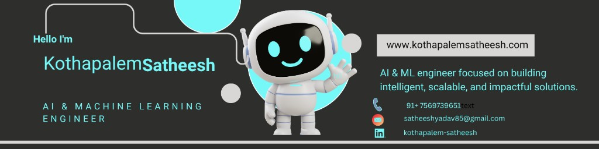

# 💫 Hi 👋, I'm **Kothapalem Satheesh**

---

---

## 👨🏻‍💻 About Me

<table>
  <tr>
    <td width="62%" valign="middle">

- 🙋‍♂️ All about me is at **[My Website](https://www.kothapalemsatheesh.com)**
- 🔭 Currently building **real-world AI/ML applications**
- 🌱 Currently learning **deep learning and scalable ML systems**
- 👯 Looking to collaborate on **AI/ML and full-stack projects**
- 🤝 Open to **internships, research, and collaborations**
- 💬 Ask me about **AI, ML, data science, and project development**
- ⚡ Fun fact: **I enjoy exploring new tools and tech daily**

  </td>
    <td width="38%" align="center" valign="middle">
      
    </td>
  </tr>
</table>

---

## 💻 Tech Stack

### 👨‍💻 Programming

### 🤖 AI / ML / NLP & Data

### 🌐 Web & Backend

### ☁️ Databases & DevOps

---

## 📊 GitHub Analytics

> Note: GitHub stat cards are cached and may take some time to reflect new commits.

---

## ✨ Developer Quote
> "AI is not here to replace human creativity, but to amplify it through intelligent systems."
>
> — Kothapalem Satheesh

---

## ☕ Support My Work
If my projects helped you, consider supporting 💙

